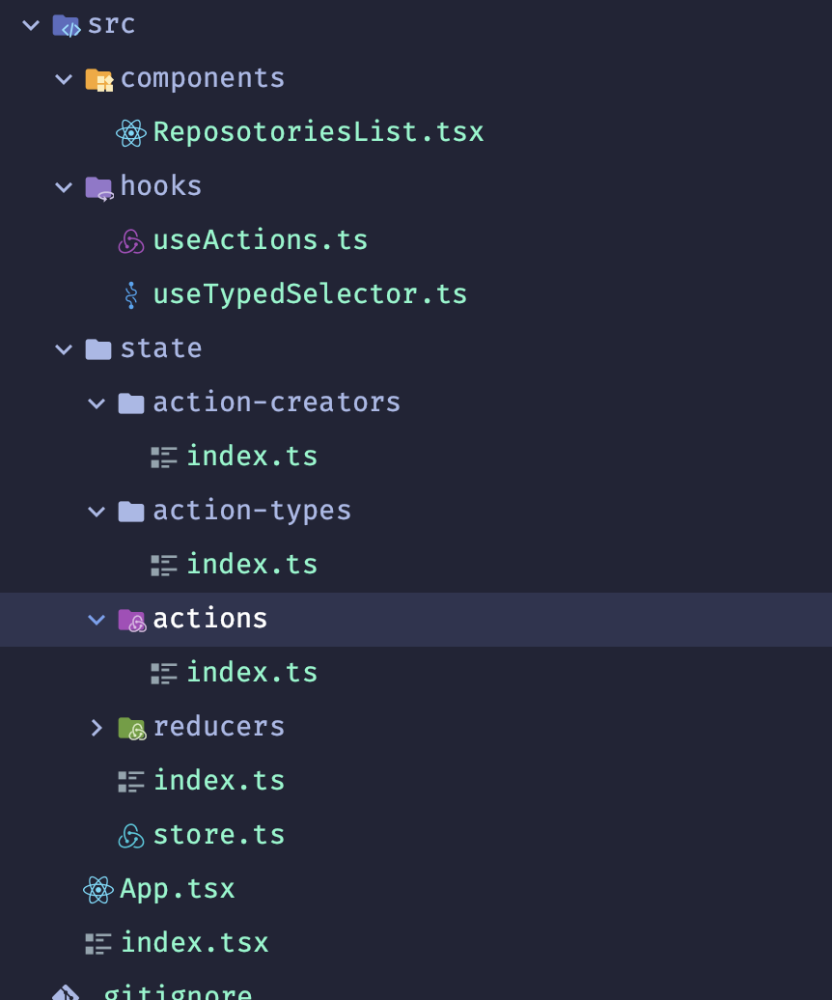

# Package installed in App

```shell
npm i react-redux redux @types/react-redux redux-thunk axios
```

## React + Ts

### interface

```tsx
interface ChildProps {
  color: string;
}
```

### function component syntax

```tsx
export const SomeChild = ({ color }: ChildProps) => {};
```

or

```tsx
export const SomeChildAsFc: React.FC<ChildProps> = ({ color }) => {
  return <>{color} </>;
};
```

### child props

```tsx
export const FcWithChildren: React.FC<FcChildProps> = ({ color }) => {
  return (
    <>
      {color}
      {children}
    </>
  );
};
```

### state

non primitive

```tsx
const [guests, setGuests] = useState<string[]>([]);
```

primitive

```jsx
const [name, setName] = useState("");
```

### onChange

```tsx
const handleOnChange = (e: React.ChangeEvent<HTMLInputElement>) => {
  setname(e.target.value);
};
return (
  <div>
    <h3>Guest List</h3>
    <input value={name} onChange={handleOnChange} />
    <button>Add Guest</button>
  </div>
);
```

### union

```tsx
type UserProps = {
  name: string;
  age: number;
};

export const UserSearch: React.FC = () => {
  const [user, setUser] = useState<UserProps | undefined>();

  const onClick = () => {};

  return <div></div>;
};
```

<br/>

<hr/>

## Redux

### store

path

```shell
src/state/store.ts
```

```ts
import { createStore, applyMiddleware } from "redux";
import thunk from "redux-thunk";
import reducer from "./reducers";

export const store = createStore(reducer, {}, applyMiddleware(thunk));
```

index.js

path

```shell
src/state/index.ts
```

```ts
export * from "./store";
export * as actionCreators from "./action-creators";
export * from "./reducers";
```

<br/>

### Reducers

Repositories Reducer

path

```shell
src/state/reducers/repositoriesReducer.ts
```

```ts
import { ActionType } from "../action-types";
import { Action } from "../actions";

interface RepositoriesState {
  loading: boolean;
  error: string | null;
  data: string[];
}

const initialState = {
  loading: false,
  error: null,
  data: [],
};

const reducer = (
  state: RepositoriesState = initialState,
  action: Action
): RepositoriesState => {
  switch (action.type) {
    case ActionType.SEARCH_REPOSITORIES:
      return { loading: true, error: null, data: [] };
    case ActionType.SEARCH_REPOSITORIES_SUCCESS:
      return { loading: false, error: null, data: action.payload };
    case ActionType.SEARCH_REPOSITORIES_ERROR:
      return { loading: false, error: action.payload, data: [] };
    default:
      return state;
  }
};

export default reducer;
```

<br/>
index.ts

path

```shell
src/state/reducers/index.ts
```

```ts
import { combineReducers } from "redux";
import repositoriesReducer from "./repositoriesReducer";

const reducers = combineReducers({
  repositories: repositoriesReducer,
});

export default reducers;

/* take reducers and give typeof whatever reducers return*/
export type RootState = ReturnType<typeof reducers>;
```

<br/>

### Action Types

index.ts

path

```shell
src/state/action-types.index.ts
```

```ts
export enum ActionType {
  SEARCH_REPOSITORIES = "search_repositories",
  SEARCH_REPOSITORIES_SUCCESS = "search_repositories_success",
  SEARCH_REPOSITORIES_ERROR = "search_repositories_error",
}
```

<br/>

<hr/>

### Action-Creators

index.ts

path

```shell
src/state/action-creators/index.ts
```

```ts
import axios from "axios";
import { Dispatch } from "redux";

import { ActionType } from "../action-types";
import { Action } from "../actions";

export const searchRepositories = (term: string) => {
  return async (dispatch: Dispatch<Action>) => {
    dispatch({
      type: ActionType.SEARCH_REPOSITORIES,
    });

    try {
      const { data } = await axios.get(
        "https://registry.npmjs.org/-/v1/search",
        {
          params: {
            text: term,
          },
        }
      );

      const names = data.objects.map((data: any) => data.package.name);

      dispatch({
        type: ActionType.SEARCH_REPOSITORIES_SUCCESS,
        payload: names,
      });
    } catch (e) {
      if (e instanceof Error) {
        dispatch({
          type: ActionType.SEARCH_REPOSITORIES_ERROR,
          payload: e.message,
        });
      }
    }
  };
};
```

<br/>

<hr/>

### Hooks

useActions.ts

path

```shell
src/hooks/useActions.ts
```

```ts
import { useDispatch } from "react-redux";
import { bindActionCreators } from "redux";
import { actionCreators } from "../state";

export const useActions = () => {
  const dispatch = useDispatch();

  return bindActionCreators(actionCreators, dispatch);
};
```

<br/>

useTypedSelector.ts

path

```shell
src/hooks/useTypedSelector.ts
```

```ts
import {
  TypedUseSelectorHook,
  useSelector as useAppSelector,
} from "react-redux";
import type { RootState } from "../state";

// Use throughout your app instead of plain `useDispatch` and `useSelector`
export const useSelector: TypedUseSelectorHook<RootState> = useAppSelector;
```

<br/>

<hr/>

## Components

RepositoriesList Component

path

```shell
src/components/ReposotoriesList.tsx
```

```tsx
// @flow
import React from "react";
import { useState } from "react";
import { useSelector } from "../hooks/useTypedSelector";
import { useActions } from "../hooks/useActions";
type Props = {};

export const RepositoriesList = (props: Props) => {
  const [term, setTerm] = useState("");
  const { searchRepositories } = useActions();
  const { loading, error, data } = useSelector((state) => state.repositories);

  const onSubmit = (event: React.FormEvent<HTMLFormElement>) => {
    event.preventDefault();
    searchRepositories(term);
  };
  return (
    <div>
      <form onSubmit={onSubmit}>
        <input value={term} onChange={(e) => setTerm(e.target.value)} />
        <button>Search</button>
      </form>
      {error && <h3>{error}</h3>}
      {loading && <h3>Loading....</h3>}
      {!error && !loading && (
        <div>
          <ul>
            {data.map((listOfData) => {
              return <li key={listOfData}>{listOfData}</li>;
            })}
          </ul>
        </div>
      )}
    </div>
  );
};
```

<br/>

### folder structure

